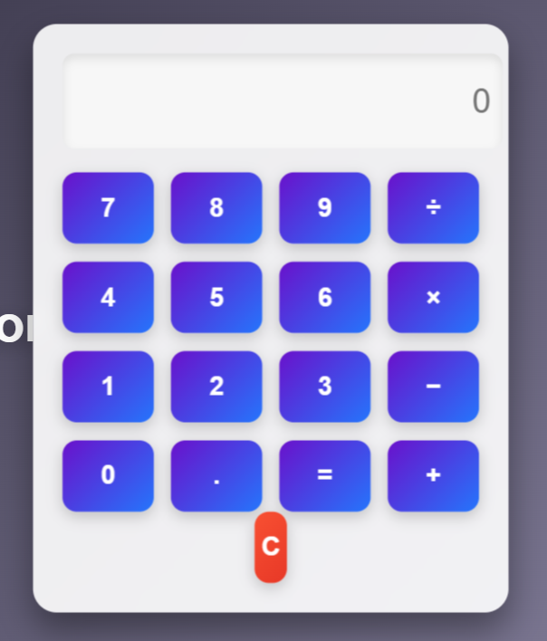

# Simple Calculator
This project is a simple calculator built using HTML, CSS, and JavaScript. It features a modern design with appealing colors and interaction effects.
## Technologies Used
- HTML
- CSS
- JavaScript
- Poppins font library
## Screenshot


## Project Setup
1. Clone the repository: `git clone <repo link>`
2. Navigate to the project directory: `cd calculator-project`
3. Install dependencies: `npm install`
4. Start the project: `npm run start`
## Code Examples
### HTML
```html
<!DOCTYPE html>
<html lang="en">
<head>
    <meta charset="UTF-8">
    <title>Calculator</title
    <link rel="stylesheet" href="style.css">
</head>
<body>
    <h1>Calculator</h1>
    <div class="calculator">
        <input id="result" type="text" value="0" readonly>
        <div class="button-grid">
            <button onclick="appendValue('7')">7</button>
            <button onclick="appendValue('8')">8</button>
            <button onclick="appendValue('9')">9</button>
            <button onclick="appendValue('/')">÷</button>
            <button onclick="appendValue('4')">4</button>
            <button onclick="appendValue('5')">5</button>
            <button onclick="appendValue('6')">6</button>
            <button onclick="appendValue('*')">×</button>
            <button onclick="appendValue('1')">1</button>
            <button onclick="appendValue('2')">2</button>
            <button onclick="appendValue('3')">3</button>
            <button onclick="appendValue('-')">-</button>
            <button onclick="appendValue('0')">0</button>
            <button onclick="clearResult()">C</button>
            <button onclick="calculate()">=</button>
            <button onclick="appendValue('+')">+</button>
        </div>
    </div>
    <script src="script.js"></script>
</body>
</html># Simple Calculator
This project is a simple calculator built using HTML, CSS, and JavaScript. It features a modern design with appealing colors and interaction effects.
## Technologies Used
- HTML
- CSS
- JavaScript
- Poppins font library
## Screenshot
A screenshot of the calculator’s design is available. You can add an image by including the path in your description.
## Project Setup
1. Clone the repository: `git clone <repo link>`
2. Navigate to the project directory: `cd calculator-project`
3. Install dependencies: `npm install`
4. Start the project: `npm run start`
## Code Examples
### HTML
```html
<!DOCTYPE html>
<html lang="en">
<head>
    <meta charset="UTF-8">
    <title>Calculator</title>
    <link rel="stylesheet" href="style.css">
</head>
<body>
    <h1>Calculator</h1>
    <div class="calculator">
        <input id="result" type="text" value="0" readonly>
        <div class="button-grid">
            <button onclick="appendValue('7')">7</button>
            <button onclick="appendValue('8')">8</button>
            <button onclick="appendValue('9')">9</button>
            <button onclick="appendValue('/')">÷</button>
            <button onclick="appendValue('4')">4</button>
            <button onclick="appendValue('5')">5</button>
            <button onclick="appendValue('6')">6</button>
            <button onclick="appendValue('*')">×</button>
            <button onclick="appendValue('1')">1</button>
            <button onclick="appendValue('2')">2</button>
            <button onclick="appendValue('3')">3</button>
            <button onclick="appendValue('-')">-</button>
            <button onclick="appendValue('0')">0</button>
            <button onclick="clearResult()">C</button>
            <button onclick="calculate()">=</button>
            <button onclick="appendValue('+')">+</button>
        </div>
    </div>
    <script src="script.js"></script>
</body>
</html>
